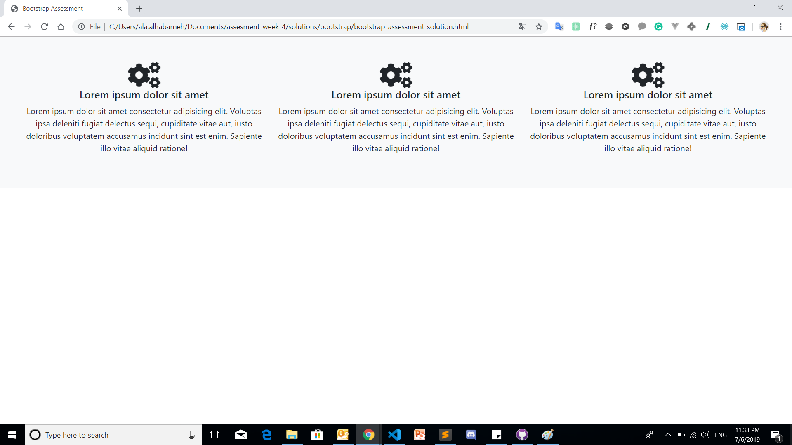

# Bootstrap Assessment
## Instructions
   - You should use the starter file [bootstrap-assessment](bootstrap-assessment.html).
   - You should not modify the HTML structure.
   - PLease put your code in the CODE AREA.
   - Only Use (https://getbootstrap.com/) as a reference.
   - You have to apply same design in the provided picture below using BOOTSTRAPS Classes ONLY.
   - Make the main container a full width container
   - Make the background for the main container : Light
   - Center all the texts using bootstrap classes :  h5, p
   
