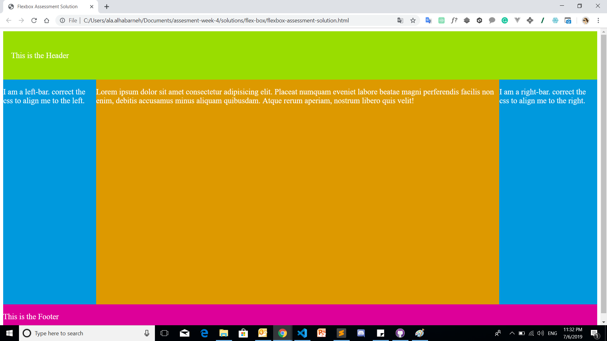

# Flexbox Assessment
## Instructions
 - You should use the starter file [flexbox-assessment](flexbox-assessment.html).
 - You should not modify the HTML structure.
 - PLease put your code in the CODE AREA.
 - Only Use (https://developer.mozilla.org/en-US/docs/Web/CSS/CSS_Flexible_Box_Layout) as a reference.</li>
 - You have to apply same design in the provided picture below using FLEXBOX ONLY.

 