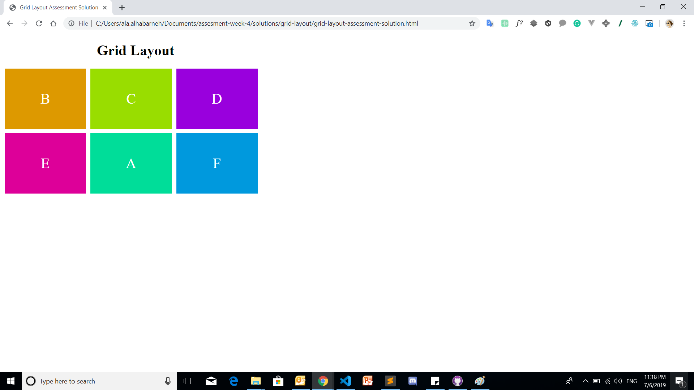

# Grid Layout Assessment
## Instructions

 - You should use the starter file [grid-layout-assessment](grid-layout-assessment.html).
  - PLease put your code in the CODE AREA.
  - Only Use (https://developer.mozilla.org/en-US/docs/Web/CSS/CSS_Grid_Layout) as a reference.
  - You have to apply same design in the provided picture below using GRID ONLY.
 - You should not modify the HTML structure.
  
 
     